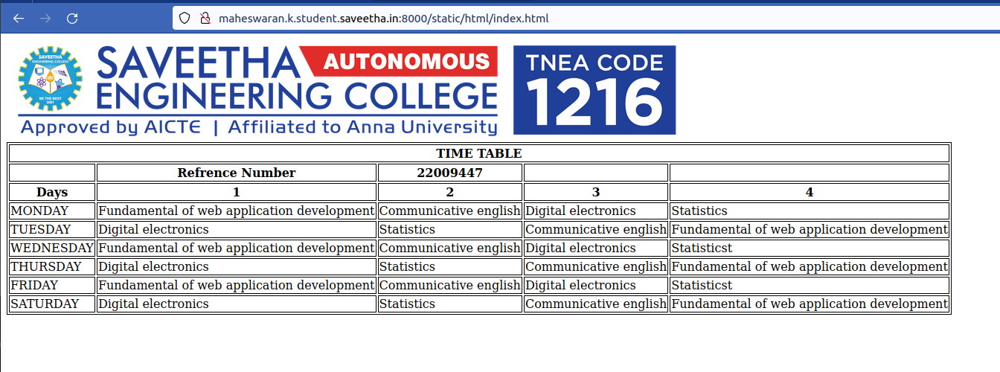

# Experiment_Time_Table

## AIM
To Write a html webpage page to display your timetable.

# ALGORITHM
### STEP 1
create a simple table using table tag
### STEP 2
Add header row using th tag
### STEP 3
Add your timetable
### STEP 4
Execute the program

# CODE
```
<!DOCTYPE html>
<html>
<style> 
       table,th,td{
         border:1px solid black;
         }
    </style>
<body>
    
    <table>
        <tr>
            <th colspan="5" textalign="center"><b>TIME TABLE</b></th>
        </tr>
        <tr>
            <th> </th>
            <th><b>Refrence Number</b></th>
            <th>22009447</th>
            <th></th>
            <th></th>
        </tr>
        <tr>
            <th>Days</th>
            <th>1</th>
            <th>2</th>
            <th>3</th>
            <th>4</th>
        </tr>
        <tr>
            <td>MONDAY</td>
            <td>Fundamental of web application development</td>
            <td>Communicative english</td>
            <td>Digital electronics</td>
            <td>Statistics</td>
        </tr>
        <tr>
            <td>TUESDAY</td>
            <td>Digital electronics</td>
            <td>Statistics</td>
            <td>Communicative english</td>
            <td>Fundamental of web application development</td>
        </tr>
        <tr>
            <td>WEDNESDAY</td>
            <td>Fundamental of web application development</td>
            <td>Communicative english</td>
            <td>Digital electronics</td>
            <td>Statisticst</td>
        </tr>
        <tr>
            <td>THURSDAY</td>
            <td>Digital electronics</td>
            <td>Statistics</td>
            <td>Communicative english</td>
            <td>Fundamental of web application development</td>
        </tr>
        <tr>
            <td>FRIDAY</td>
            <td>Fundamental of web application development</td>
            <td>Communicative english</td>
            <td>Digital electronics</td>
            <td>Statisticst</td>
        </tr>
        <tr>
            <td>SATURDAY</td>
            <td>Digital electronics</td>
            <td>Statistics</td>
            <td>Communicative english</td>
            <td>Fundamental of web application development</td>
        </tr>
    </table>
</body>
</html>
```
# OUPUT

